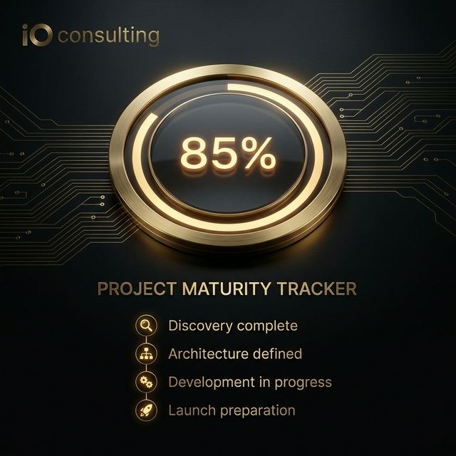

# iO Consulting: Project Maturity Tracker

A professional, single-file "Gold Standard" tool for tracking project deliverables, assessing organizational maturity, and driving high-performance execution. Built for PMO leads, CTOs, and Project Directors who demand visual clarity and rigorous governance.

## Overview
The **Project Maturity Tracker** is a portable, browser-based tool designed to standardize project delivery across complex organizations. It combines a rigorous deliverables checklist with real-time maturity scoring to ensure that "Done" actually means "Done" according to industry best practices.

## Key Features
- **Maturity Scoring**: Dynamic grading of project progress based on item completion and evidence-backed notes.
- **Executive PDF Reporting**: Dedicated print CSS that transforms the dashboard into a formal, boardroom-ready dossier.
- **"At-Risk" Intelligence**: Automated glow highlights (amber for upcoming, red for overdue) based on target delivery dates.
- **Copy Executive Summary**: 1-click generation of a summary snippet for Slack/Teams updates.
- **Export to AI**: Generating an `ai-context.md` snapshot of your project state to drop into ChatGPT/Claude.
- **Auto-Save**: Integrated `localStorage` ensures your data stays in your browser, even without an internet connection.
- **Single-File App (SFA)**: No installation required. Just download and run in any modern browser.
- **Export/Import**: Move your data between environments using CSV export.
- **Pro Visualization**: Real-time progress dashboards and maturity gradients.

## Authoritative Resources
This tool is aligned with global standards for project excellence:
1. [PMI OPM3 (Organizational Project Management Maturity Model)](https://www.pmi.org/pmbok-guide-standards/foundational/organizational-project-management-opm) - The global benchmark for organizational maturity.
2. [AXELOS P3M3 (Portfolio, Program, and Project Management Maturity Model)](https://www.axelos.com/certifications/propath/p3m3) - Evaluates maturity across project, program, and portfolio dimensions.
3. [CMMI (Capability Maturity Model Integration)](https://cmmiinstitute.com/) - A framework for process improvement and efficiency.
4. [ISO 21500:2021 (Project, Programme and Portfolio Management)](https://www.iso.org/standard/74741.html) - International standardized guidance on project governance.
5. [PMBOK® Guide (Project Management Body of Knowledge)](https://www.pmi.org/pmbok-guide-standards/foundational/pmbok) - The definitive guide for project management professionals.

## Branding
Developed by **iO consulting**.
- **Website**: [www.osipov.uk](https://www.osipov.uk)
- **Inquiries**: [consult@osipov.uk](mailto:consult@osipov.uk)

---
© 2026 iO consulting. MIT Licensed.
